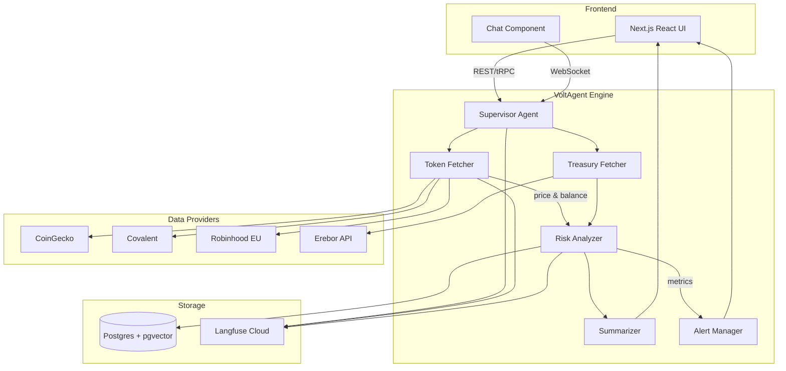
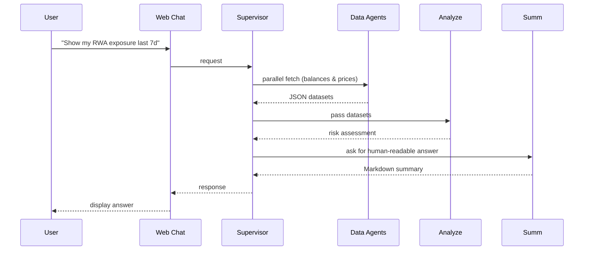
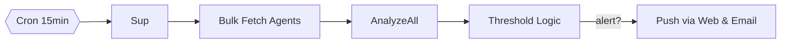

# TokenScope – The AI-Powered Dashboard for Tokenized Asset & Treasury Intelligence

## 1. Executive Summary
CodeQuity2025 challenges builders to create investor-ready MVPs that solve real problems. TokenScope is an online platform—backed by a multi-agent AI engine—that gives founders, investors, and finance teams a single pane of glass over the exploding landscape of tokenized assets: stock tokens, BTC-treasury equities, on-chain RWAs, stablecoins, and cash balances.

Today, retail users and startup treasuries juggle spreadsheets, block-explorer links, and multiple exchanges to understand risk exposure. TokenScope unifies these data silos, delivers real-time analytics, and explains insights in plain English through autonomous AI agents. The prototype ships as a web app (Next.js + VoltAgent) deployed to Vercel, demo-ready within the hackathon window.

## 2. Alignment with Hackathon Requirements
* **Problem Statement** – Solves fragmented visibility across modern financial instruments, empowering builders to make data-driven decisions.
* **Innovation & Originality** – First dashboard that fuses Web3 tokenization data **and** AI multi-agent reasoning for contextual, conversational insights.
* **Technical Execution** – Built in TypeScript with VoltAgent supervisor-worker architecture, Langfuse observability, and vector RAG memory.
* **Usefulness & Market Potential** – Targets fast-growing niches (tokenized stocks, startup BTC treasuries). Early adopters: solo founders & small funds.
* **Pitch Clarity & Investor Readiness** – Clear revenue model (SaaS + premium risk modules) and demoable metrics.

## 3. Key Features
| Category | Feature | Why It’s Innovative |
|----------|---------|--------------------|
| Portfolio Aggregation | Connect wallets, CEX accounts, Robinhood EU token portfolios, and mock Erebor bank accounts | Unified view across traditional & on-chain holdings |
| Multi-Agent Insights | VoltAgent sub-agents fetch data, run risk models, generate daily briefs | Human-like reasoning, auto-explanatory outputs |
| Real-Time Alerts | Volatility, de-pegs, treasury concentration, staking yield drops | Prevent costly surprises |
| Conversational Query | Ask questions (“How did my BTC exposure change vs last week?”) | Natural interface via chatbox |
| Observability Dashboard | Langfuse traces, metrics per agent | Enterprise-grade debugging & audit trail |
| Export & API | Download CSV / call JSON API for accounting tools | Extensible ecosystem |

## 4. Detailed Tech Stack
* **Frontend**: Next.js 15 (App Router) + TailwindCSS + Shadcn/ui
* **AI Orchestration**: **VoltAgent** (TypeScript) with Supervisor → Fetcher / Analyzer / Summarizer / Alert agents
  * Reasoning Tools & Memory (pgvector)
* **LLM Providers**: OpenAI gpt-4o-mini (analysis) & gpt-3.5-turbo-1106 (summaries)
* **Data Sources**:
  * CoinGecko & Alchemy Transact SDK (ERC-20 & RWA tokens)
  * Robinhood ON (stock token market data)
  * Covalent API (cross-chain balances)
  * Mock Erebor/Roxom REST (for demo)
* **Backend**: Next.js API routes (Edge Functions) + Postgres (Supabase) w/ `pgvector`
* **Observability**: Langfuse exporter built into VoltAgent
* **Auth & Security**: NextAuth.js (OAuth) + tRPC for type-safe calls; `.env.example` for secrets
* **CI/CD**: GitHub Actions → Vercel Preview/Production

## 5. High-Level Architecture


## 6. Repository / File Structure
```
root/
├─ apps/
│   └─ web/            # Next.js frontend
├─ packages/
│   └─ agent/          # VoltAgent engine code
├─ scripts/            # Seed & mock scripts
├─ prisma/             # Database schema
├─ slides/             # Marimo notebook presentation
└─ docs/               # Additional docs (max 10 files cap)
```

## 7. Program-Flow Diagrams
### Agent Conversation Sequence


### Alert Scheduler Logic


## 8. Business & Revenue Model
* **Freemium**:
  * Free tier: 1 wallet + 1 exchange + basic alerts
  * Pro ($15/mo): unlimited sources, custom alerts, CSV export
* **Enterprise API**: Metered usage for funds integrating TokenScope analytics
* **Future Tokenomics**: Explore governance token for community-contributed risk models (post-MVP)

## 9. Roadmap & Future Improvements
| Phase | Timeline | Milestones |
|-------|----------|------------|
| Hackathon | Now → Jul 16 | MVP live on Vercel; demo slide deck & video; covers ETH mainnet + Robinhood EU test data |
| Post-Hackathon (Q3 2025) | • Add BTC-treasury equities via Roxom API <br>• Plug in on-chain RWA token indices (RealT, Ondo) <br>• Mobile-first responsive redesign |
| Q4 2025 | • Integrate Erebor bank sandbox <br>• Launch AI Recommendation Engine (yield optimization) <br>• Security audit & SOC2 planning |
| 2026+ | • Governance token & community plugin market (risk models, prompts) <br>• ML forecasting module using historical treasury datasets <br>• Expand to commodities & carbon credits tokenization |

## 10. Team & Roles
* **(Your Name)** – Full-stack TS engineer & AI orchestrator
* [If team] – Add designer / BD lead roles

## 11. Required Hackathon Deliverables Mapping
| Deliverable | Where Provided |
|-------------|----------------|
| Title & Tagline | “TokenScope – Your AI Dashboard for Tokenized Assets & Treasury Risk” |
| Project Description | Section 1 & 2 above |
| Tech Stack | Section 4 |
| Public GitHub Repo | `/workspace` root (to be pushed) with README & visuals |
| Demo | Vercel live link + screen-recorded walk-through in slides/README |
| Pitch Video (2-4 min) | Recorded Marimo slides with narration |
| Team Info | Section 10 |

---
TokenScope transforms fragmented token data into actionable intelligence through autonomous AI agents—addressing a pressing pain for modern builders and aligning perfectly with CodeQuity2025’s vision of execution-oriented innovation.